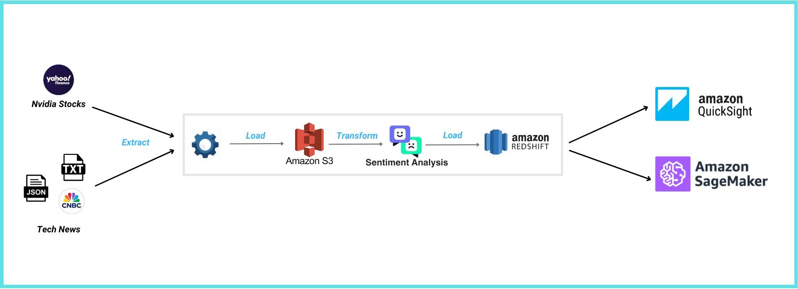
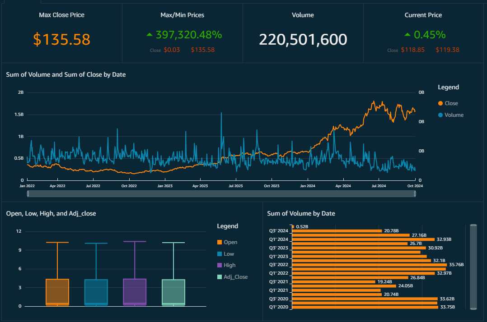

# Sentiment Analysis and NVIDIA Stock Prediction

## Project Overview

This project aims to perform sentiment analysis on news articles related to NVIDIA and predict its stock price movements based on the extracted sentiment data. By analyzing the correlation between public sentiment and stock performance, we aim to provide insights into how news influences investor behavior.

### Project Architecture


### Visualization Dashboard


## Table of Contents

- [Project Objectives](#project-objectives)
- [Technologies Used](#technologies-used)
- [Data Sources](#data-sources)
- [Project Structure](#project-structure)
- [Installation and Setup](#installation-and-setup)
- [Results](#results)

## Project Objectives

- Perform sentiment analysis on news articles related to NVIDIA.
- Collect historical stock price data for NVIDIA.
- Build predictive models to forecast stock prices based on sentiment scores.
- Visualize trends in sentiment and stock prices over time.
- Provide insights on the relationship between news sentiment and stock price movements.

## Technologies Used

- Python (check  ***./requirements.txt***  for all necessary libraries)
- NLTK (for sentiment analysis)
- AWS Quicksight (for visualization)
- Jupyter Notebook on AWS SageMaker (for LSTM prediction model training)
- AWS S3 Bucket and AWS Redshift (for data storage)

## Data Sources

- **News Articles**: Retrieved from news APIs (Yahoo, Google News API, CNBC, Blomberg).
- **Sentiment Analysis**: Utilized NLP libraries (NLTK VADER) for sentiment scoring.
- **Stock Price Data**: Historical stock prices obtained from financial APIs (Yahoo Finance).


## Project Structure

### Detailed Component Descriptions

- **data/**: 
  - **raw/**: This directory contains the unprocessed data files, including raw news, raw indexes and data for upload to S3 Bucket.
  - **processed/**: This directory holds processed datasets that are cleaned and transformed for analysis and model training.

- **notebooks/**: 
    - `LSTM_stock_prediction.ipynb`: This notebook is dedicated to building and evaluating predictive models, showcasing how sentiment influences stock price predictions.

- **etl/**: 
  - Contains the main source code for the project.
    - `extract_and_preprocess/`: A folder responsible for collecting news articles and stock price data from APIs.
    - `transform/`: A folder that processes the collected articles to compute sentiment scores using NLP techniques.
    - `load`: A folder for loading and saving file in DWH or WL.

- **requirements.txt**: 
  - A file listing all the Python dependencies required to run the project. Use `pip install -r requirements.txt` to install them.

- **README.md**: 
  - This file provides documentation for the project, including setup instructions, usage guidelines, and contribution details.

- **env-config.cfg**: 
  - A file containing the essential information and personal details to connect and config system.

## Installation and Setup

To get started with the Sentiment Analysis and NVIDIA Stock Prediction project, follow the steps below to set up your environment.

### Prerequisites

Before you begin, ensure you have the following installed on your machine:

- Python 3.7 or higher
- pip (Python package installer)
- Git (for cloning the repository)
- Jupyter Notebook (optional, for running the notebooks)

### Step 1: Clone the Repository

First, clone the repository to your local machine:

```bash
git clone https://github.com/AnhNN04/news-sentiment-analysis-nvidia-stock-prediction.git
```

## Result

The results from training a stock prediction model with and without sentiment data highlight the significant impact that sentiment analysis has on model performance.

### Without Sentiment Data:
- **Training MSE:** 0.000627
- **Training R-squared:** 0.815
- **Test MSE:** 0.00829
- **Test R-squared:** 0.858

The model without sentiment data shows a good fit with an **R-squared of 0.815** on the training set, indicating the model explains 81.5% of the variance in the training data. However, the test performance drops slightly with an **R-squared of 0.858**, reflecting a moderate ability to generalize to unseen data.

### With Sentiment Data:
- **Training MSE:** 0.000084
- **Training R-squared:** 0.975
- **Test MSE:** 0.00401
- **Test R-squared:** 0.931

Incorporating sentiment data into the model significantly improves both the training and test performance. The **training R-squared increases to 97.5%**, and more importantly, the **test R-squared jumps to 93.1%**, indicating the model can explain 93.1% of the variance in the test data. The **Test MSE** also decreases, reflecting a lower prediction error.

### Summary:
The inclusion of sentiment data enhances the model's predictive power and generalizability. The test results show a clear improvement in performance with sentiment data, emphasizing the value of sentiment analysis in stock prediction models. Thus, utilizing sentiment data from news sources provides a substantial boost to the accuracy and effectiveness of stock market predictions.
